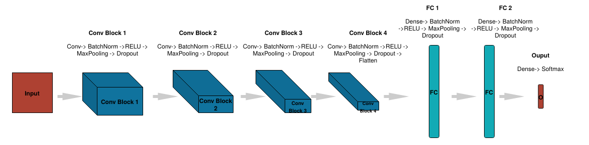

# Facial Expression Recognition with Keras

<div align="center">
  
</div>

<br>

<div align="center">

[](https://colab.research.google.com/github/mohd-faizy/03P_Facial_Expression_Recoginition/blob/master/01_Facial_Expression_Recoginition_with_Keras.ipynb)
[](https://www.python.org/)
[](https://docs.astral.sh/uv/)
[](https://www.tensorflow.org/)
[](https://keras.io/)
[](https://opencv.org/)
[](https://flask.palletsprojects.com/)
[](https://opensource.org/licenses/MIT)

</div>

An end-to-end, production-ready computer vision and deep learning system built with **TensorFlow 2 / Keras**, **OpenCV**, and **Flask**. The project trains a 4-block deep Convolutional Neural Network (CNN) from scratch on the **FER-2013** dataset to classify human facial expressions across seven categories (*Angry, Disgust, Fear, Happy, Neutral, Sad, Surprise*) and streams live video predictions with real-time bounding box annotations and emotion labels to a modern web interface.

---

## 📑 Table of Contents

- [Key Highlights](#-key-highlights)
- [Repository Structure](#-repository-structure)
- [Dataset: FER-2013](#-dataset-fer-2013)
- [Model Architecture & Theory](#-model-architecture--theory)
- [Step-by-Step Setup & Usage Guide](#-step-by-step-setup--usage-guide)
  - [Step 1: Clone Repository & Virtual Environment (uv)](#step-1-clone-repository--virtual-environment-uv)
  - [Step 2: Install Dependencies with uv](#step-2-install-dependencies-with-uv)
  - [Step 3: Dataset Acquisition & Extraction](#step-3-dataset-acquisition--extraction)
  - [Step 4: Train the Deep CNN Model](#step-4-train-the-deep-cnn-model)
  - [Step 5: Launch Real-Time Flask Server](#step-5-launch-real-time-flask-server)
  - [Step 6: Access Live Web Dashboard](#step-6-access-live-web-dashboard)
- [Command-Line Arguments Reference](#-command-line-arguments-reference)
- [Desktop vs. Laptop Testing (Demo Simulation Mode)](#-desktop-vs-laptop-testing-demo-simulation-mode)
- [Troubleshooting & FAQs](#-troubleshooting--faqs)
- [Connect with Me](#-connect-with-me)

---

## ✨ Key Highlights

- **Modernized & Future-Proof**: Fully compatible with TensorFlow 2.x and Keras 3 (`.weights.h5` checkpoint standard and explicit `Input()` layer conventions).
- **Decoupled Architecture**: Model topology is cleanly serialized to [`models/model.json`](models/model.json), separating architecture definition from learned weights in [`models/model.weights.h5`](models/model.weights.h5).
- **Zero-Hardware Simulation Mode**: Automatically detects if no physical camera is attached and switches to an offline simulation demo mode with rate-limited frame pacing (~25 FPS, <1% CPU load) so the entire pipeline can be tested without a webcam.
- **Dynamic GPU Memory Growth**: Modern TensorFlow memory growth configuration (`tf.config.experimental.set_memory_growth`) prevents greedy VRAM allocation.
- **Glassmorphic Streaming Dashboard**: Modern dark-theme web interface with animated badge indicators and responsive video feed.

---

## 📁 Repository Structure

```
03P_Facial_Expression_Recoginition/
│
├── assets/
│   ├── model.png                           # CNN architecture pipeline diagram
│   └── sample_face.jpg                     # Demo simulation test image for offline execution
├── models/
│   ├── haarcascade_frontalface_default.xml # OpenCV Haar Cascade frontal face detector
│   ├── model.json                          # Exported CNN architecture topology
│   └── model.weights.h5                    # Trained Keras model weights (or model_weights.h5)
├── src/
│   ├── __init__.py                         # Package initialization with lazy imports
│   ├── camera.py                           # OpenCV video capture, Haar cascade, & demo mode
│   └── model.py                            # TF2/Keras FacialExpressionModel inference engine
├── templates/
│   └── index.html                          # Modern dark-mode Flask streaming dashboard
│
├── Facial_Expression_Recoginition_with_Keras.ipynb  # End-to-end training notebook
├── main.py                                 # Flask web application server with CLI support
├── requirements.txt                        # Project dependencies specification
├── README.md                               # Comprehensive project documentation
└── .gitignore                              # Git ignore rules for heavy binaries & caches
```

---

## 📊 Dataset: FER-2013

The dataset originates from the Kaggle [Challenges in Representation Learning: Facial Expression Recognition Challenge](https://www.kaggle.com/c/challenges-in-representation-learning-facial-expression-recognition-challenge/data).

- **Format**: $48 \times 48$ grayscale images centered on human faces.
- **Target Categories**: 7 canonical emotions.
- **Class Imbalance Mitigation**: The *Disgust* class contains only 436 training samples compared to ~4,000+ for other categories; real-time horizontal flipping (`ImageDataGenerator(horizontal_flip=True)`) is applied to boost generalization.

| Class Index | Emotion Label | Description | Training Samples |
| :---: | :--- | :--- | :---: |
| **0** | `Angry` | Eyebrows lowered, pressed lips | ~3,995 |
| **1** | `Disgust` | Wrinkled nose, raised upper lip (Minority class) | ~436 |
| **2** | `Fear` | Wide eyes, parted lips | ~4,097 |
| **3** | `Happy` | Raised corners of mouth, smile | ~7,215 |
| **4** | `Neutral` | Relaxed baseline expression | ~4,965 |
| **5** | `Sad` | Corners of mouth drawn down | ~4,830 |
| **6** | `Surprise` | Eyebrows raised, open mouth | ~3,171 |

---

## 🧠 Model Architecture & Theory

```
Input Tensor: (Batch_Size, 48, 48, 1)
   │
   ├── [Conv Block 1] Conv2D(64, 3x3) -> BatchNorm -> ReLU -> MaxPool2D(2x2) -> Dropout(0.25)
   │
   ├── [Conv Block 2] Conv2D(128, 5x5) -> BatchNorm -> ReLU -> MaxPool2D(2x2) -> Dropout(0.25)
   │
   ├── [Conv Block 3] Conv2D(512, 3x3) -> BatchNorm -> ReLU -> MaxPool2D(2x2) -> Dropout(0.25)
   │
   ├── [Conv Block 4] Conv2D(512, 3x3) -> BatchNorm -> ReLU -> MaxPool2D(2x2) -> Dropout(0.25)
   │
   ├── Flatten (Feature Map -> 1D Vector)
   │
   ├── [Dense Block 1] Dense(256) -> BatchNorm -> ReLU -> Dropout(0.25)
   │
   ├── [Dense Block 2] Dense(512) -> BatchNorm -> ReLU -> Dropout(0.25)
   │
   └── [Output Layer] Dense(7, Softmax) -> Predicted Probability Distribution
```

> **Theoretical Reference:**  
> Goodfellow, I.J., et al. (2013). *Challenges in representation learning: A report of three machine learning contests.* Neural Networks, 64, 59-63. [doi:10.1016/j.neunet.2014.09.005](https://arxiv.org/pdf/1307.0414.pdf)

---

## 🛠️ Step-by-Step Setup & Usage Guide

### Step 1: Clone Repository & Virtual Environment (uv)

```bash
# 1. Clone repository
git clone https://github.com/mohd-faizy/03P_Facial_Expression_Recoginition.git
cd 03P_Facial_Expression_Recoginition

# 2. Create virtual environment with uv
uv venv

# 3. Activate virtual environment (Optional if using `uv run`)
# macOS / Linux:
source .venv/bin/activate

# Windows (Command Prompt - cmd.exe):
.venv\Scripts\activate.bat

# Windows (PowerShell):
.venv\Scripts\Activate.ps1
```

### Step 2: Install Dependencies with uv

```bash
# Install all required dependencies
uv add -r requirements.txt
```

> [!TIP]
> `uv` resolves and installs Python dependencies up to 10–100x faster than traditional pip. On macOS (Apple Silicon M-series) or machines with NVIDIA GPUs, TensorFlow will automatically leverage available acceleration.

### Step 3: Dataset Acquisition & Extraction

The dataset contains the FER-2013 training/testing splits ($48 \times 48$ grayscale face crops across 7 emotion categories) and the custom `utils` module.

Run the 1-line download & extraction command in your terminal:

```bash
curl -L -o Project.zip "https://www.dropbox.com/scl/fi/zpamlummigq0a74aqcmu8/Project.zip?rlkey=h9hn0qr10pxulmtrh4frv2ryw&dl=1" && unzip -uq Project.zip && cp -rn Project/train . 2>/dev/null || cp -r Project/train . && cp -rn Project/test . 2>/dev/null || cp -r Project/test . && cp -rn Project/utils . 2>/dev/null || cp -r Project/utils . && rm -rf Project.zip Project
```

This sets up the required hierarchy in your project root:
```
03P_Facial_Expression_Recoginition/
├── train/
│   ├── angry/ ... surprise/
├── test/
│   ├── angry/ ... surprise/
└── utils/
    └── datasets/
        └── fer.py
```

### Step 4: Train the Deep CNN Model

Launch the interactive Jupyter training notebook:

```bash
# Direct launch with uv (macOS / Linux / Windows):
uv run jupyter notebook Facial_Expression_Recoginition_with_Keras.ipynb

# Or within an activated virtual environment:
jupyter notebook Facial_Expression_Recoginition_with_Keras.ipynb
```

**Inside the notebook**:
- **Section 1 & 2**: Verifies hardware, imports libraries, and sets up working directory.
- **Section 3**: Exploratory data analysis, sample visualization, and class distribution counts.
- **Section 4**: Mini-batch generation (size 64) with real-time horizontal flip data augmentation.
- **Section 5**: 4-block deep CNN definition compiled with `Adam(learning_rate=0.0005)`.
- **Section 6**: Training for 15 epochs using `ModelCheckpoint` and `ReduceLROnPlateau`.
- **Section 7**: Serializes the trained network:
  - [`models/model.json`](models/model.json): Model topology.
  - [`models/model.weights.h5`](models/model.weights.h5): Learned model weights.

> [!NOTE]
> **Prefer Cloud Training?** Click [](https://colab.research.google.com/github/mohd-faizy/03P_Facial_Expression_Recoginition/blob/master/Facial_Expression_Recoginition_with_Keras.ipynb) to train on Google Colab with a free GPU. If you train on Colab, run the download cell at the end of the notebook to transfer `model.weights.h5` into your local `models/` folder.

### Step 5: Launch Real-Time Flask Server

You can run the server directly with `uv run` (recommended across all platforms, no manual environment activation required) or using your activated virtual environment:

#### Option A: Direct with `uv run` (Recommended)

- **macOS / Linux**:
  ```bash
  uv run python main.py
  ```

- **Windows (Command Prompt or PowerShell)**:
  ```cmd
  uv run python main.py
  ```

#### Option B: Using an Activated Virtual Environment

- **macOS / Linux**:
  ```bash
  source .venv/bin/activate
  python main.py
  ```

- **Windows (Command Prompt - cmd.exe)**:
  ```cmd
  .venv\Scripts\activate.bat
  python main.py
  ```

- **Windows (PowerShell)**:
  ```powershell
  .venv\Scripts\Activate.ps1
  python main.py
  ```

> [!NOTE]
> **macOS Port Auto-Switching**: macOS reserves port `5000` for native AirPlay Receiver (`ControlCenter`). [`main.py`](main.py) automatically detects this conflict and binds to port `5001`. On Windows and Linux, it defaults to port `5000`. You can specify a custom port anytime with `--port <number>` (e.g. `uv run python main.py --port 8080`).

### Step 6: Access Live Web Dashboard

Open your web browser and navigate to the address shown in your terminal:
- **macOS (default)**: [http://localhost:5001](http://localhost:5001)
- **Windows / Linux (default)**: [http://localhost:5000](http://localhost:5000)

---

## ⚙️ Command-Line Arguments Reference

[`main.py`](main.py) accepts several optional CLI flags for flexible runtime configuration:

| Argument | Type | Default | Description |
| :--- | :---: | :---: | :--- |
| `--source` | `str / int` | `None` (auto-detect) | Video input source: camera index (e.g., `0`, `1`) or local video path (e.g., `videos/sample.mkv`). |
| `--demo` | `flag` | `False` | Force offline demo simulation mode without requiring a physical camera. |
| `--host` | `str` | `0.0.0.0` | Network host address to bind the Flask server. |
| `--port` | `int` | `5000` (auto-fallback to `5001+` if busy) | Port number on which the application listens. |
| `--debug` | `flag` | `False` | Run Flask in debug mode with hot reloading. |

#### Examples:

```bash
# Force demo simulation mode (ideal for machines without webcams)
uv run python main.py --demo

# Run with an external webcam device index
uv run python main.py --source 1

# Run with a pre-recorded video file
uv run python main.py --source videos/facial_exp.mkv

# Custom port binding (e.g. port 8080)
uv run python main.py --port 8080 --host 127.0.0.1
```

---

## 💻 Desktop vs. Laptop Testing (Demo Simulation Mode)

| Execution Scenario | Command | Behavior |
| :--- | :--- | :--- |
| **Desktop (No Camera)** | `uv run python main.py` | Automatically detects missing camera, logs `[WARN] Video source '0' could not be opened. Enabling Demo Simulation Mode`, and streams inference on [`assets/sample_face.jpg`](assets/sample_face.jpg) at 25 FPS without consuming high CPU. |
| **Desktop (Force Demo)** | `uv run python main.py --demo` | Explicitly launches demo simulation mode. |
| **Laptop (With Webcam)** | `uv run python main.py` | Automatically connects to built-in webcam (`device 0`) and streams real-time live video and predictions. |

---

## 🔧 Troubleshooting & FAQs

### 1. `FileNotFoundError: Model JSON file not found`
- **Cause**: The model architecture JSON was not found.
- **Fix**: The repository includes [`models/model.json`](models/model.json) by default. If running after custom training, make sure Section 7 of the notebook wrote to `models/model.json`.

### 2. No Webcam Attached / Black Screen
- **Fix**: Run `python main.py --demo` or simply run `python main.py`. The built-in auto-fallback detects that camera `0` is inaccessible and streams using the demo test face.

### 3. OpenCV Haar Cascade Warning
- **Fix**: [`src/camera.py`](src/camera.py) checks [`models/haarcascade_frontalface_default.xml`](models/haarcascade_frontalface_default.xml) and falls back to `cv2.data.haarcascades`. Ensure dependencies are installed via `uv add -r requirements.txt`.

### 4. GPU Out-of-Memory (OOM)
- **Fix**: Dynamic GPU memory allocation is enabled by default in [`src/model.py`](src/model.py). For training on low-memory GPUs, reduce `batch_size` in the notebook from `64` to `32`.

### 5. macOS Port 5000 Already in Use (`AirPlay Receiver`)
- **Cause**: macOS Control Center binds port `5000` for native AirPlay.
- **Fix**: [`main.py`](main.py) automatically detects the port collision and falls back to port `5001`. Alternatively, start the server on another port using `uv run python main.py --port 8080`, or disable AirPlay Receiver in **macOS System Settings** > **General** > **AirDrop & AirPlay**.

### 6. Training on Colab vs. Local Inference
- **Cause**: Training in Google Colab saves weights to Colab's cloud filesystem (`/content/models/model.weights.h5`), not your local machine.
- **Fix**: In Google Colab, run the download cell (or right-click `models/model.weights.h5` in the file tree and click **Download**), then place the file into your local `models/` directory before starting `main.py`.

---

## 🔗 Connect with Me

<div align="center">

[](https://twitter.com/F4izy)
[](https://www.linkedin.com/in/mohd-faizy/)
[](https://ai.stackexchange.com/users/36737/faizy)
[](https://github.com/mohd-faizy)

</div>